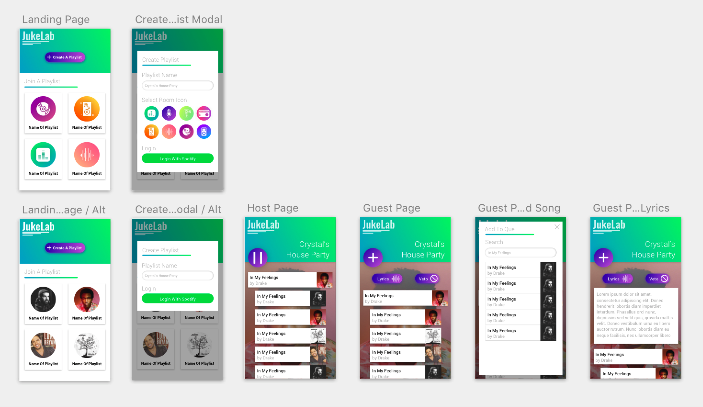

# JukeLab
https://aehaq.github.io/JukeLab/

# About JukeLab
Hosting a party and looking for the perfect playlist? If you want tunes that satisfy all your friends, open up JukeLab and you and your friends can create a collaborative dynamic playlist for your get together! With JukeLab you can add songs from any browser, whether it’s on your phone or at your desktop. 

# Getting Started
To Access JukeLab, click the link above and you will be redirected to the landing page. From this page you can either choose to be a host, and create your own playlist, or you can choose to join an existing playlist.

If you choose to Host, you will be prompted to log in with your Spotify account. Currently the Spotify SDK only supports users with Premium accounts, so you will need Spotify Premium to use JukeLab as well. The Spotify SDK is not compatible with most mobile browsers, so the Host will need to use a desktop computer to control playback. You will be redirected to a host page for your playlist. From here you can create a playlist hosted exclusively on this web application, and play the music from this webpage.

Now that you are hosting a playlist, your playlist will appear as an option on the landing page. A guest can hop onto your playlist by selecting it from the list of playlists on the landing page. The guest does not need to be prompted to log in with their Spotify account to make this work. Additionally, the guest is not restricted to a desktop platform, and the use of mobile devices for interacting with the host's playlist is encouraged. Once the guest is on your playlist, they can also add songs to your playlist, but will not have control over playback. There currently is no limit to the number of guests who can join your playlist.

In order to add songs to the playlist you must first bring up the search modal with the (+) button at the bottom left of the page header. Then use the input bar to search for songs from Spotify. Click on any of the results to add that song to your playlist.

JukeLab is a work in progress, so there are a few things to keep in mind with it's current iteration:
* Currently the first song in the playlist must be added by the host for JukeLab to function properly.
* Attempting to add new songs after reaching the end of the JukeLab generated playlist has been known to cause bugs.
* Authorization tokens from Spotify only last one Hour. After that point, your playlist will become inert.
* Obsolete playlist rooms currently need to be removed manually by the JukeLab team. Some of the listed playlists are only examples, as a proof of concept.

# Images
* On Desktop

 * On Mobile

# Technologies
* AJAX - POST & PUT calls
* APIs - Spotify, Lyrics by Apiseeds
* JQuery
* Firebase
* UIkit
* Spotify SDK
* User Input Validation - Prevent users from adding duplicate or empty playlist names

# Code snippets

The code pictured above is the initialization of the Spotify SDK. In order for the SDK to respond to a natively hosted playlist, logic gates and functions had to be put in place within the playback state function, which would track when the state of playback was altered. Whenever a song is finished playing, we alter an array of objects which represent the songs queued up and data relevant to it, removing the first object and using an AJAX PUT call to play the next song by using its spotify song ID.

The playlist object is queued up in a Google Firebase database, and the information about the songs is initially grabbed as part of the search functionality. Selecting a song from the search saves the associated data-attributes to firebase, and we then use a jQuery call to display the list on both the Host and the Guest pages.

# Features
* Collaborative dynamic playlist
* Multiple users joining playlist from either desktop or mobile
* Play / Pause / Skip
* Lyrics display

# Future Features
* Automatic Refresh of Spotify API tokens for uninterrupted playback.
* Removing songs from the playlist as a host.
* Guest voting to veto undesired songs from a playlist.
* Using Spotify Recommendations to suggest songs for the playlist based off of current track list.
* Singalong Mode where Lyrics appear according to the song's playback position.
* Playlist sharing and privacy options.
* Option for host to save the party playlist to their Spotify Account.
* More Robust search features

# Authors
* [Azfar E Haq](https://github.com/aehaq)
* [Andrew Ton](https://github.com/atton88)
* [Craig Melville](https://github.com/acekreations) 
* [Shuhan Laura Lee](https://github.com/lalatw)

# License
Standard MIT License
